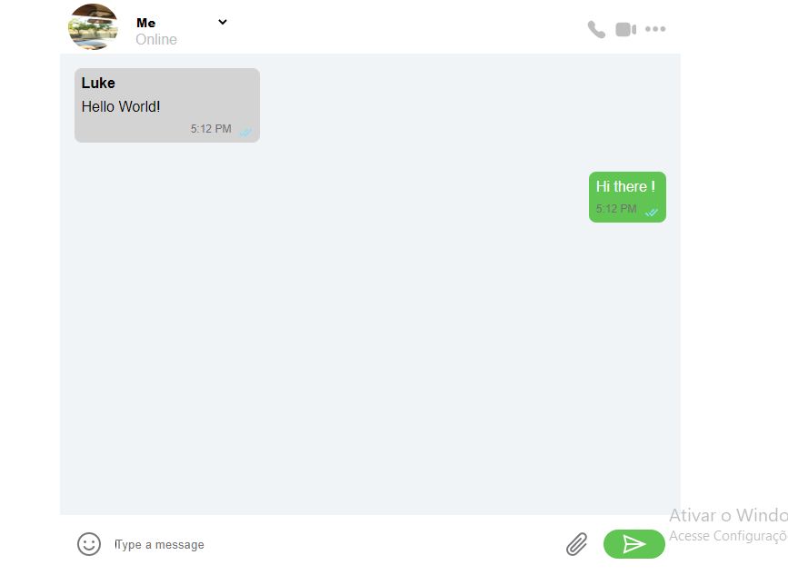

# React-MyMessenger

This project simulate perfectly a WhatsApp Group where, trought React Applications, you can choose which user is going to send the messages, for example, you can choose between Rob, Luke, me and Etc. If you choose me the messages will change their style (like the original app). To produce this application it was used basics and advanced React content including many tools and librarys; styled-components, useState, useEffect, React Data Flow and others.

- JSX
- Components
- Props
- States
- React Data Flow
- Array rendering
- Conditional Rendering
- useEffects
- Styled-components

## 📄 Description
1. WhatsApp Group
    - At the top of the page, a select input was created, there, you can choose between the users, Luke, Rob, John, me and others. If tou choose user "me", the messages will change, exaclty like WhatsApp. The Main page will show a inital message send by "Luke", one of the users you can select. 
    - At the bottom of the page, there is a input for ther messages, this input works with 2 different functions one to send messages simulating a group and other to send real messages to real persons.
    - When the key "Enter" is pressed, the user will send messages as the selected user, but if the user press the Green button "Send Messages Real Button".

2. Send Real Messages Function
    - This special function can send real messages to real persons using the original app. When you write the message, instead of press the "Enter", you should click on the green button; this way a prompt will open and ask you which number you want to send. If you complete and press "OK", the WhatsApp will automatically open in the conversation that you have choosen with the message on the input, after that it's just send!

    ## ⚒️ Technologies

## 📫 Reach me

E-mail: lucascalabria86@gmail.com

